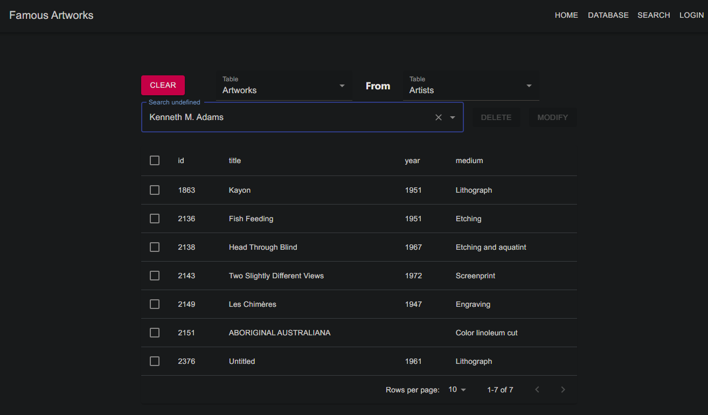

# Famous Artworks Application

This application provides information about various famous artworks and allows users to interact with them in different ways.

## Features

- View all famous artworks
- Scrum operations like fetch, update, and delete
- Direct and indirect relations between artworks

## Pages

- Home: Displays famous artworks and provides links to other pages
- Database: Allows for any modification to the artworks database including the modification of relations and creation of data
- Search: Allows for the indirect and direct relational searching, like Art Periods of a given Artist

## Instructions

To run this project locally:

1. Clone the repository
2. Run `npm install` to install all necessary dependencies in client and server directories
3. Run `npm start` in the client directory to start the application
4. Run `node app.js` in the server directory in a separate terminal to start the server

## Technologies Used

- React
- Express

